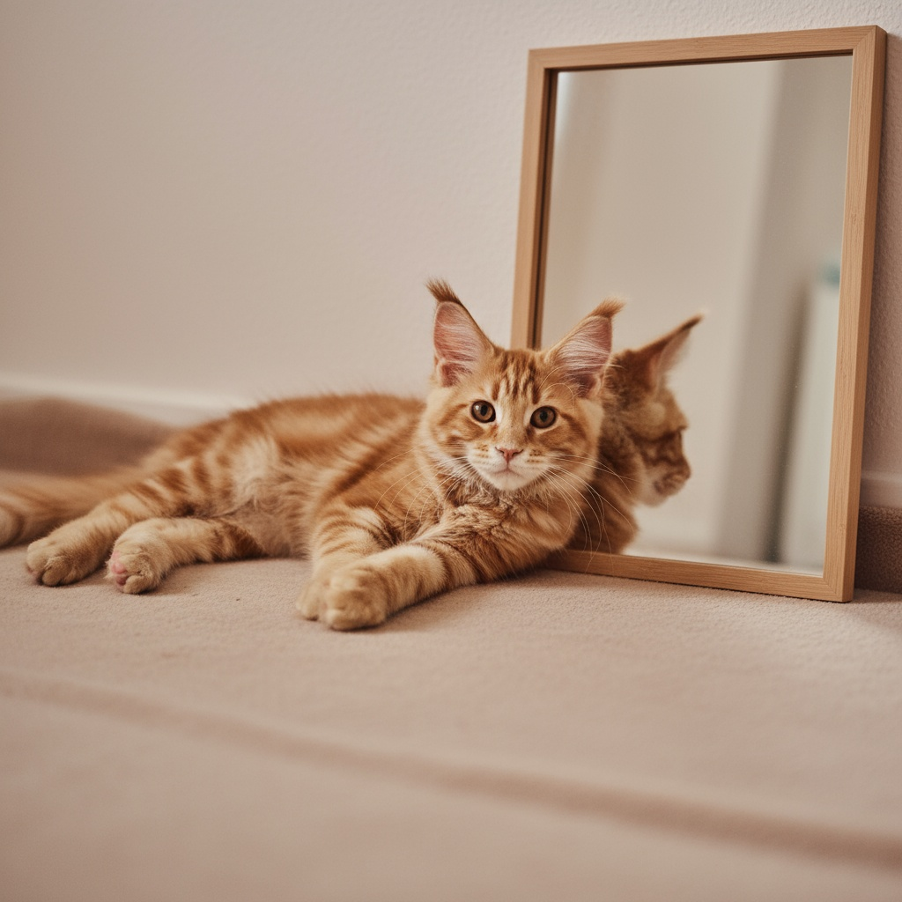
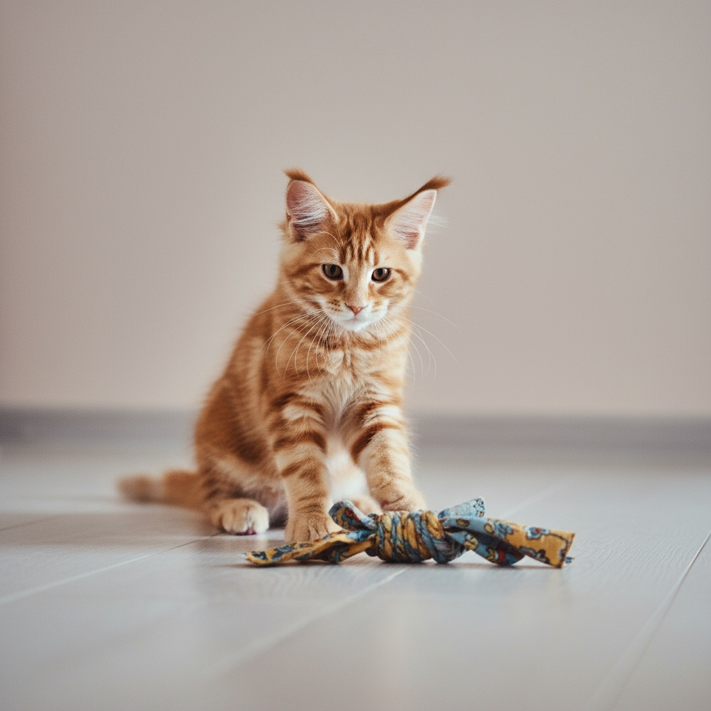
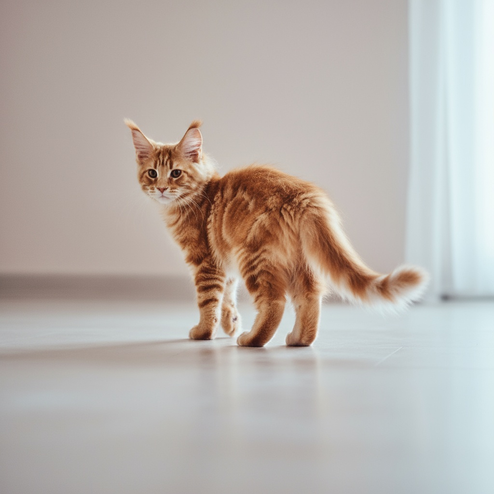
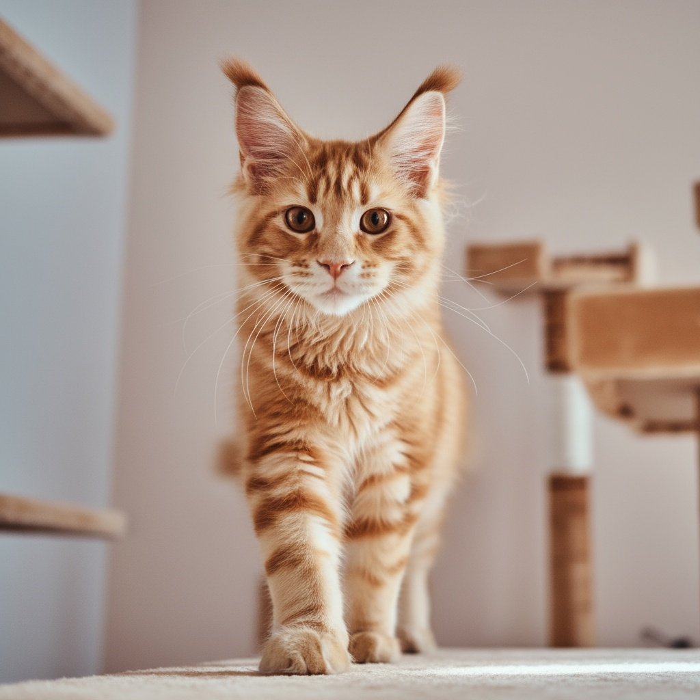
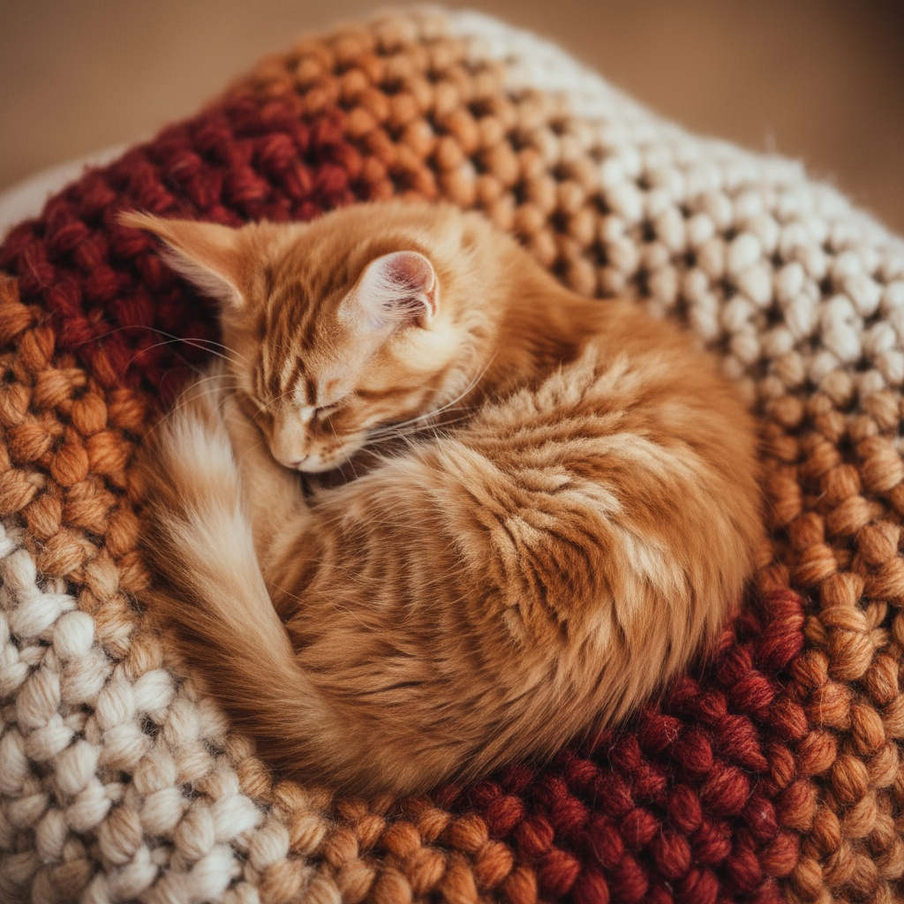
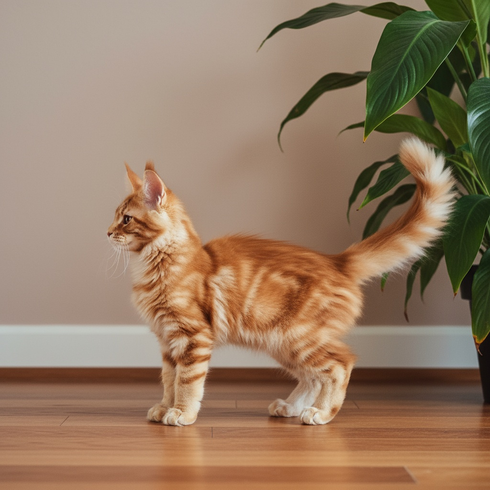
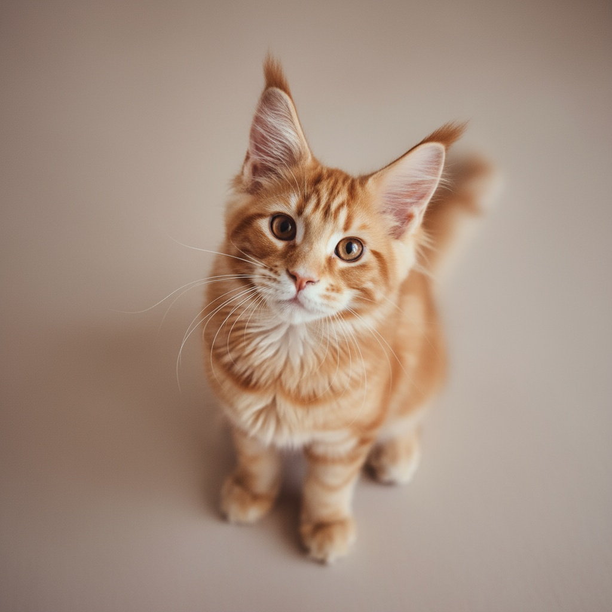

# DreamBooth tutorial – Stable Diffusion + LoRA

Large text-to-image models can generate high-quality, diverse images from text, but they usually can’t faithfully reproduce and recontextualize a specific subject from only a few photos. DreamBooth fine-tunes a pretrained text-to-image model so a unique token (an identifier) in the prompt will refer to that specific subject. During training we show the model a small set of instance images of the subject together with class images (to preserve generality) – the model learns to associate the new token with the subject’s visual appearance. After fine-tuning, using that token in a prompt produces photorealistic images of the subject in new poses, styles, or scenes. This tutorial shows how to train a LoRA-style DreamBooth on Stable Diffusion 3.5-medium and run inference for recontextualization, art rendition, and property modification.

<begin> <p align="center">     <br/> </p> <end>
<begin> <p align="center">     <br/> </p> <end>

---

## Overview

This guide walks you through:

1. Creating a VM and connecting via SSH
2. Installing the required software (Hugging Face `diffusers`, PEFT, etc.)
3. Running the training
4. Running the inference

---

## Repository layout

The tutorial repository `dreambooth-tutorial/` is organized as follows (paths are relative to the repo root):

* `data/cat_gmc/` – instance images (your example subject images)
* `data/prompts/recontextualization.txt` – prompts for inference
* `scripts/sd3_lora.sh` – helper script to launch training
* `inference.py` – inference helper for SD3 + LoRA
* `outputs/sd3-lora/` – where LoRA weights and generated images go

---

## 1. Create VM & connect 

This workflow requires a VM with a GPU that has at least 80 GB of HBM (the example runs were performed on an NVIDIA H200). In our measurements, inference peak usage was ~36.0 GB allocated and ~40.6 GB reserved. Based on the reserved inference footprint, a full (all-parameters) fine-tune – once you add optimizer state, gradients and activations – typically increases memory needs by roughly 4x, so you should plan for ~162.4 GB of HBM (or use multi-GPU/model/optimizer sharding). By contrast, LoRA (PEFT) in our runs peaked at ~78.8 GB and therefore fits on single 80 GB-class GPUs such as H100/H200.

You can create a Compute virtual machine (VM) through the [web console](https://console.nebius.com) (choose “Auto assign dynamic IP” for the Public IP), the CLI, or the Terraform provider, see the [Nebius AI Cloud documentation](https://docs.nebius.com/compute/virtual-machines/manage) for instructions. After creating VM:
```
ssh <user>@<IP>
```

---

## 2. Install environment & dependencies

Create a Python virtual environment, install `diffusers` and requirements for the SD3 DreamBooth example.

```
# clone the repo for diffusers and create a venv

git clone https://github.com/huggingface/diffusers.git
python3 -m venv ~/.venvs/dreambooth
source ~/.venvs/dreambooth/bin/activate
pip install --upgrade pip

# install diffusers in editable mode and example requirements

cd diffusers
pip install -e .
cd examples/dreambooth
pip install -r requirements_sd3.txt

# install PEFT and wandb

python -m pip install "peft>=0.17.0"
pip install wandb

# login to Hugging Face

hf auth login --token hf_<your_token>
hf auth whoami
```

---

## 3. Training

For fine-tuning, 24 instance images were used: two – gmc_001.jpeg and gmc_002.jpeg – were sourced from [Freepik (author: fxquadro, free license)](https://www.freepik.com/author/fxquadro), and the remaining 22 images in `data/cat_gmc/` were generated with [Nano Banana](https://nanobanana.ai/). Class images were generated by the model itself using `--class_prompt`. Helper script `scripts/sd3_lora.sh` launches `train_dreambooth_lora_sd3.py` via `accelerate` with example arguments:

```
# clone the repo with DreamBooth tutorial

git clone https://github.com/dashabalashova/dreambooth-tutorial.git

# make script executable (one time) and run it

chmod +x dreambooth-tutorial/scripts/sd3_lora.sh
dreambooth-tutorial/scripts/sd3_lora.sh
```

The script encapsulates these arguments:
* `--pretrained_model_name_or_path` – base SD3 model (`stabilityai/stable-diffusion-3.5-medium`)
* `--instance_data_dir` – your subject images folder (`data/cat_gmc`)
* `--class_data_dir` – class images used for prior preservation; if the number of images in this directory is less than `--num_class_images`, the missing images will be generated using `--class_prompt`
* `--instance_prompt` – prompt for instance images (training)
* `--validation_prompt` – prompt for instance images (validation)
* `--class_prompt` – prompt for class images (prior preservation)
* `--with_prior_preservation` and `--prior_loss_weight` – enable prior preservation
* `--num_class_images` -- number of images for prior preservation
* `--resolution` – image size (default: `512` for 512 x 512)
* `--train_batch_size` – sets the per-step mini-batch size (default: `1`)
* `--gradient_accumulation_steps` – makes the trainer accumulate gradients over that many mini-batches before taking an optimizer step (default: `4`); effective batch size = train_batch_size x gradient_accumulation_steps, see [Hugging Face Accelerate guide](https://huggingface.co/docs/accelerate/usage_guides/gradient_accumulation)
* `--learning_rate` – base optimizer learning rate for most parameters (default: `5e-4`)
* `--text_encoder_lr` – separate learning rate for the text encoder (default: `1e-4`)
* `--optimizer` – optimizer to use (default: `AdamW`)
* `--lr_scheduler` – learning-rate scheduler type (default: `constant_with_warmup`)
* `--lr_warmup_steps` – number of warmup steps for the LR scheduler
* `--max_train_steps` – number of optimization steps
* `--report_to` – experiment tracker to report metrics to default: `wandb`)
* `--validation_epochs` – how often (in epochs) to run validation / generate validation samples
* `--seed` – random seed for reproducibility

---

## 4. Inference

Use the included `inference.py` helper to load LoRA weights and run SD3 inference. 

Flags:
* `--lora` – path to a LoRA directory, a `.safetensors` file, or an HF repo id containing LoRA weights.
* `--prompts_file` or `--prompt` – provide prompts (one per line when using a file).
* `--num_images` – images per prompt
* `--num_steps` – number of diffusion steps (28 in example for balance of speed/quality)
* `--guidance` – classifier-free guidance scale (commonly 7.5–8.5)
* `--height` / `--width` – output resolution

---

Place your inference prompts (one per line) in `data/prompts/<prompts>.txt` or call `--prompt "your prompt here"`. Output images are saved under the `--outdir` path. Each prompt will create a directory `NNN_<prompt-safe-name>/img_XX.png`.

Recontextualization inference:
```
python dreambooth-tutorial/inference.py \
  --pretrained_model_name_or_path stabilityai/stable-diffusion-3.5-medium \
  --lora dreambooth-tutorial/outputs/sd3-lora/pytorch_lora_weights.safetensors \
  --prompts_file dreambooth-tutorial/data/prompts/recontextualization.txt \
  --outdir dreambooth-tutorial/outputs/sd3-lora/images \
  --num_images 4 --num_steps 28 --guidance 7.5 --height 1024 --width 1024
```
<begin> <p align="center">     <br/> </p> <end>

Art rendition inference:
```
python dreambooth-tutorial/inference.py \
  --pretrained_model_name_or_path stabilityai/stable-diffusion-3.5-medium \
  --lora dreambooth-tutorial/outputs/sd3-lora/pytorch_lora_weights.safetensors \
  --prompts_file dreambooth-tutorial/data/prompts/art.txt \
  --outdir dreambooth-tutorial/outputs/sd3-lora/art_images \
  --num_images 4 --num_steps 28 --guidance 7.5 --height 1024 --width 1024
```
<begin> <p align="center">     <br/> </p> <end>

Property modification inference:
```
python dreambooth-tutorial/inference.py \
  --pretrained_model_name_or_path stabilityai/stable-diffusion-3.5-medium \
  --lora dreambooth-tutorial/outputs/sd3-lora/pytorch_lora_weights.safetensors \
  --prompts_file dreambooth-tutorial/data/prompts/property.txt \
  --outdir dreambooth-tutorial/outputs/sd3-lora/property_images \
  --num_images 4 --num_steps 28 --guidance 7.5 --height 1024 --width 1024
```
<begin> <p align="center">     <br/> </p> <end>

## 5. Clean up (optional)
Open [Nebius AI web console](https://console.nebius.com). Find the VM you want to delete. Click the three vertical dots (⋮) on the instance row and choose Delete – in the confirmation dialog, check Delete boot disk if you also want the instance disk removed.
